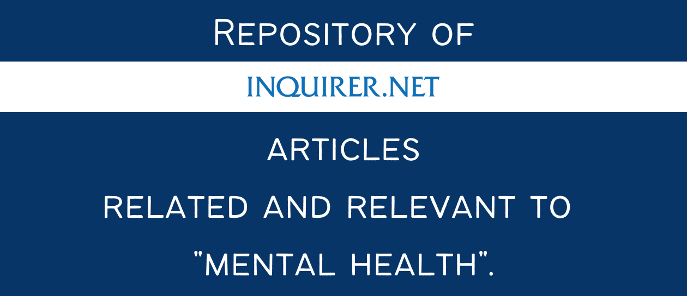
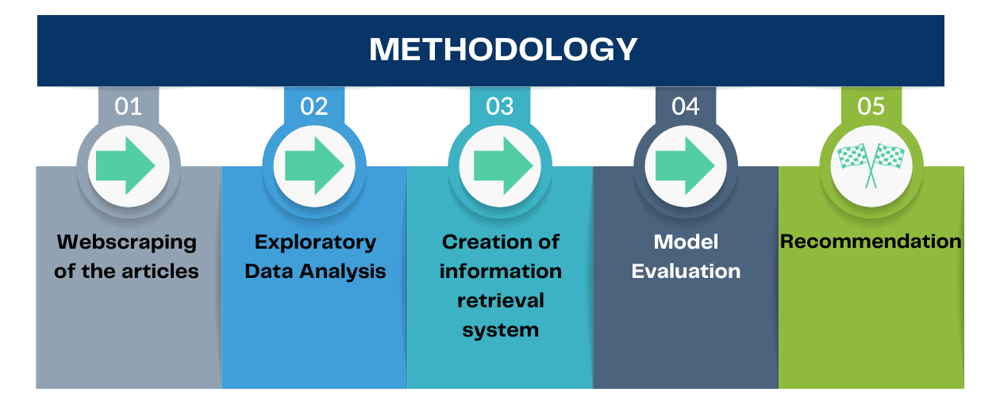

# Information Retrieval on Inquirer News Articles


This is a data mining project utilizing information retrieval techniques to provide recommendations to users. The notebook containing the technical report is `Mental Health in Inquirer.ipynb`.

## Overview

Mental health is a crucial aspect of well-being, impacting how individuals think, feel, and act. It plays a pivotal role in stress management, social interactions, and decision-making. However, mental health problems can lead to challenges like negative thinking, reduced motivation, distress, and mental illnesses such as anxiety and depression. The recent COVID-19 pandemic has exacerbated mental health issues globally, with a 25% increase in anxiety and depression rates, especially among young people and women (World Health Organization, 2022). Recognizing the significance of mental health, this project aims to curate a repository of articles, primarily sourced from Inquirer.net, providing insights and information on mental health care.

## Dataset

The dataset is composed of articles that were scraped from Inquirer.net based on two criteria.

- News articles categorized under the "lifestyle" tag.
- Search results obtained from the search keyword "mental health."

These articles were combined to create a comprehensive dataset, retaining key information such as article title, URL, publication date, article text, and category tags. The data collection process, including web scraping methods can be explored in the `Web Scraping Inquirer.ipynb` file.

## Methodology

The high-level pipeline implemented in this project is as follows.



## Installation

To run this project, you can set up the required environment by installing the necessary packages using the provided `requirements.txt` file:
```bash
pip install -r requirements.txt
```

## License

This project is licensed under the MIT License. See the [LICENSE](LICENSE) file for further details.